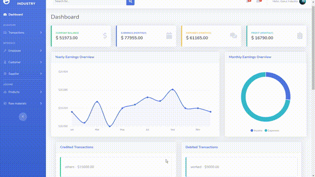

# Global Industry

Global Industry is a web-based administrative tool that enables small-scale manufacturing companies to manage their operations more efficiently. The tool provides a centralized platform for companies to maintain stock and production details, manage employees and their salaries and track customer orders. Each company is assigned a separate database schema, which ensures their data is secure and protected from unauthorized access.

# Requirements :

- download Postgresql and pgAdmin

- pip install Django

- pip install django-mathfilters

- pip install psycopg2

- pip install django-tenants

- pip install gunicorn whitenoise dj-database-url psycopg2

# How to run

1. create a database (same name as in settings.py)

2. Migrating schemas - python manage.py migrate_schemas

3. Create super user - python manage.py createsuperuser

4. Create public tenant - python manage.py create_tenant

   1. give schema name as 'public'
   2. give user as '1'
   3. domain - 'globalindustry.localhost'

5. python manage.py runserver

6. go to the url - http://globalindustry.localhost:8000/

# Samples

